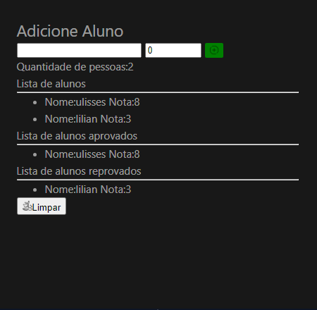

# Notas Vue
Projeto desenvolvido durante a aula da faculdade, um gerenciador de alunos e suas notas desenvolvido com VueJS

# Orgs

Projeto desenvolvido durante a aula da faculdade, um gerenciador de alunos e suas notas desenvolvido onde  possivel adicionar e remover alunos e suas notas e classificalos como aprovados ou reprovados utilizando VueJS

## 🔨 Funcionalidades do projeto

Um gerenciador de alunos onde  possivel adicionar e remover alunos e suas notas e classificalos como aprovados ou reprovados utilizando VueJS

## ✔️ Técnicas e tecnologias utilizadas

As técnicas e tecnologias utilizadas pra isso são:

- `Vuejs`: framework JavaScript de código-aberto, focado no desenvolvimento de interfaces de usuário
- `HTML`: Linguagem de Marcação de HiperTexto
- `CSS`: Cascading Style Sheets ou Folhas de Estilo em Cascata
- `JAVASCRPT`: uma linguagem de programação interpretada estruturada

## 🎯 Desafio

Tela de detalhes do produto:

## 📁 Acesso ao projeto

Você pode [acessar o código fonte do projeto inicial](https://github.com/Joseulisses065/notasvue) 

## 🛠️ Abrir e rodar o projeto

Para visualizar o projeto final acesse o link abaixo:
[acessar o projeto](https://replit.com/@JoseUlisses1/BlankVue)